# T05 — Guía paso a paso

**Protección de datos: cifrado con VeraCrypt y verificación de integridad con SHA‑256**

***

# 1. TAREA 1 — Cifrado simétrico con VeraCrypt (Confidencialidad)

## 1.1. Preparar el entorno

1.  En el Escritorio de Windows, crear una carpeta llamada:


<!---->

    PENDRIVE_SIMULADO

2.  Instalar VeraCrypt desde su página oficial.

***

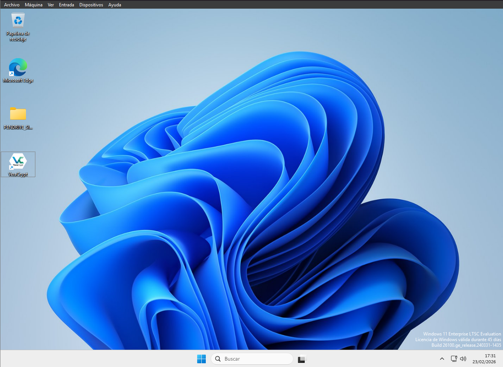

## 1.2. Crear un contenedor cifrado (.hc)

Abrir VeraCrypt y seguir estos pasos:


1.  Click en **Create Volume**.
2.  Seleccionar **Create an encrypted file container** → Next.
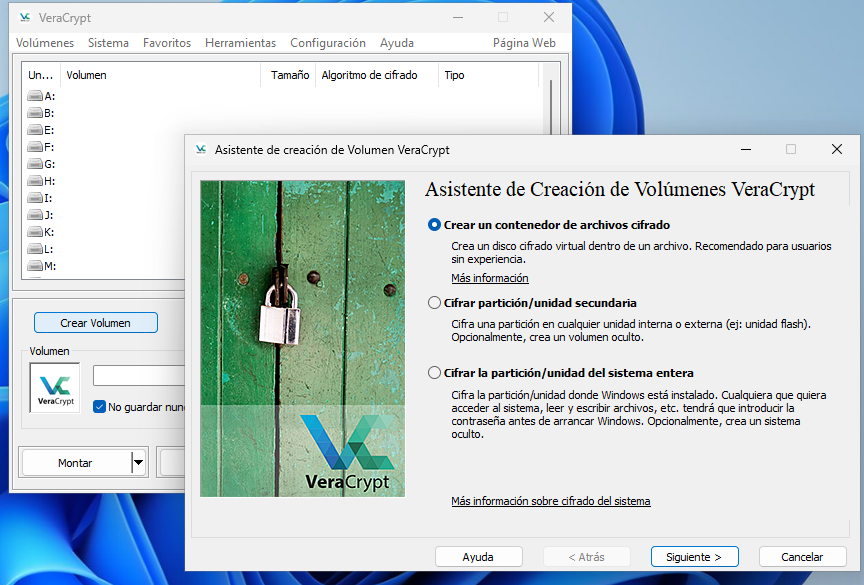
3.  Seleccionar **Standard VeraCrypt volume** → Next.
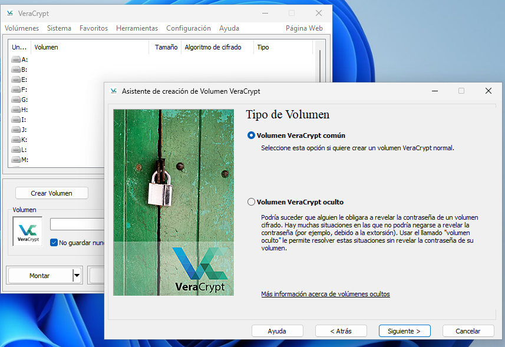
4.  Click en **Select File…**  
    Guardar en:  
    Escritorio → PENDRIVE\_SIMULADO  
    Nombre del archivo:
        examen_seguro.hc
        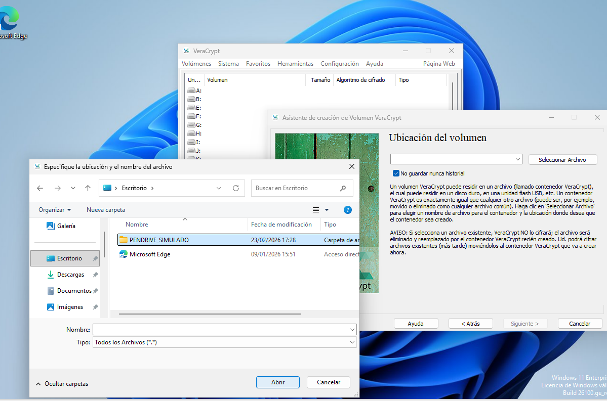
5.  Next.

**Configuración de cifrado:**

*   Encryption Algorithm: **AES**
*   Hash Algorithm: **SHA‑256**
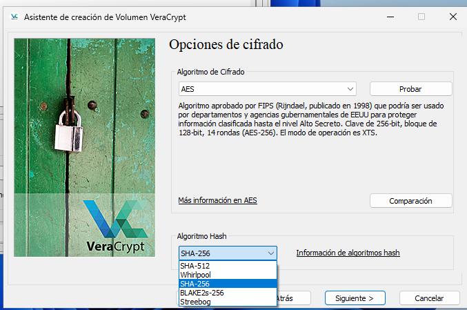
6.  Tamaño del volumen:
        100 MB
        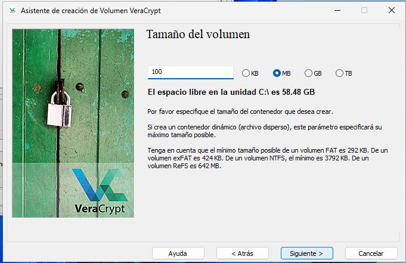

7.  Contraseña robusta (mínimo 14 caracteres).
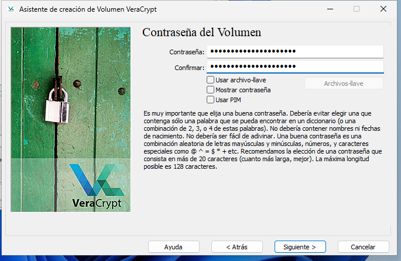
8.  Sistema de archivos: **NTFS**.
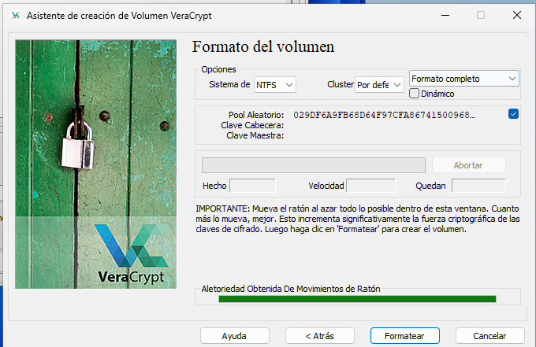
9.  Click en **Format**.  
    Al finalizar aparecerá: *“Volume created successfully”*.
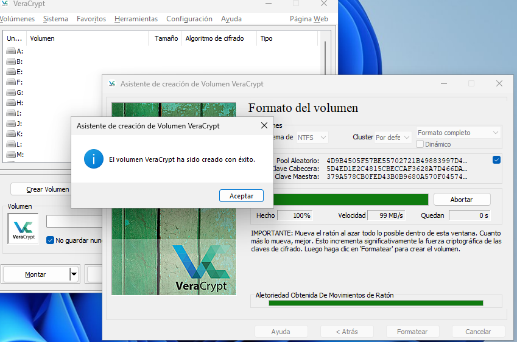
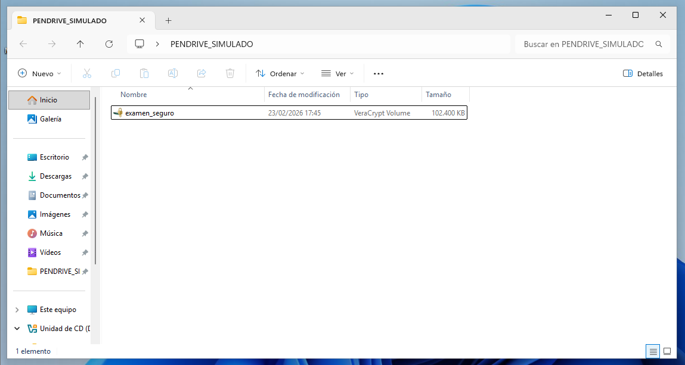
***

## 1.3. Montar el contenedor cifrado (.hc)

1.  En VeraCrypt, seleccionar una letra de unidad libre (ejemplo: **Z:**)
2.  Click en **Select File…**, elegir:
<!---->

    PENDRIVE_SIMULADO\examen_seguro.hc
3.  Click en **Mount**.
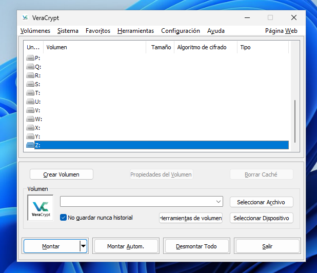
4.  Introducir la contraseña.
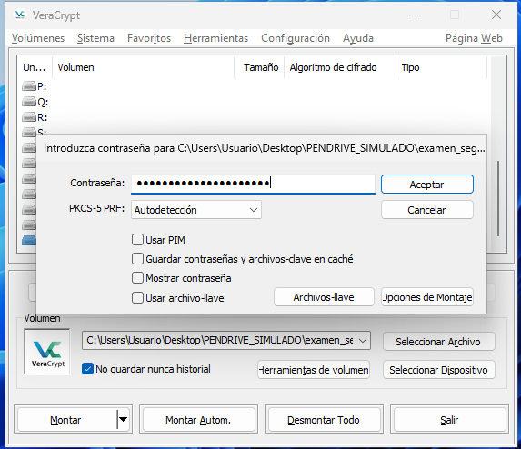
5.  Comprobar que aparece una unidad nueva (Z:) en el Explorador.
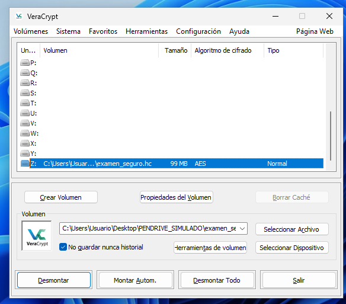
***

## 1.4. Crear el archivo de examen dentro del volumen cifrado

En la unidad Z:

1.  Crear un archivo llamado:

<!---->

    EXAMEN_FINAL_SEGURETAT.txt

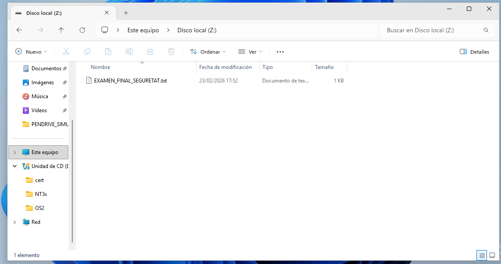

2.  Escribir contenido de prueba (preguntas de examen).

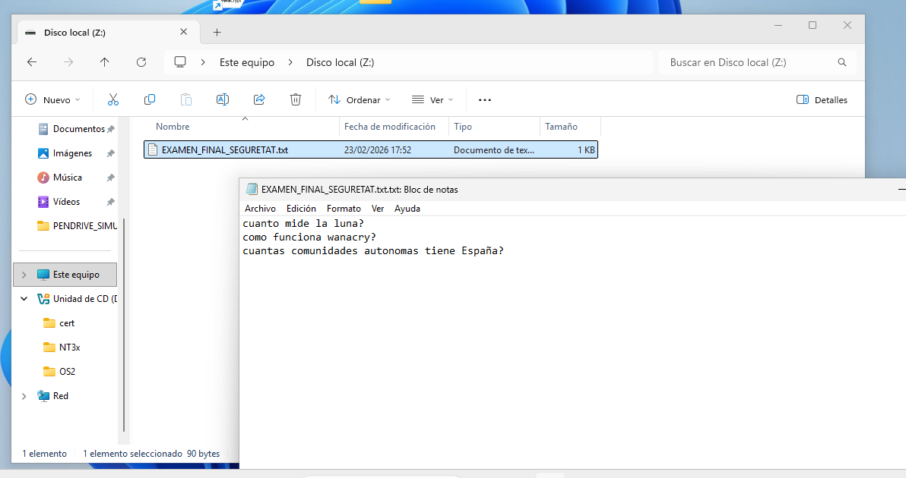

3.  Guardar y cerrar.

***

## 1.5. Demostrar que el archivo es inaccesible sin montar el volumen

1.  En VeraCrypt, click en **Dismount**.

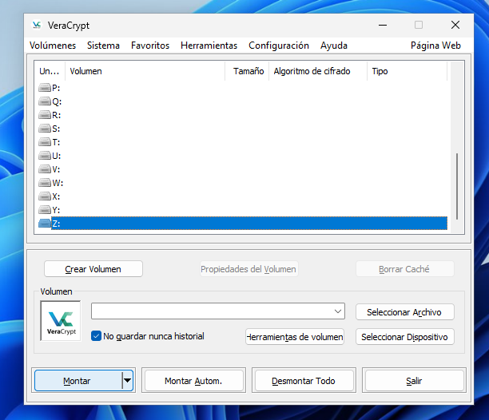

2.  Desde el Explorador, intentar abrir:

<!---->

    PENDRIVE_SIMULADO\examen_seguro.hc

Resultado esperado:

*   Windows no lo abre como carpeta.
*   Solo ofrece abrirlo con VeraCrypt (pero sin acceso al contenido).

Esto demuestra la confidencialidad.

***

# 2. TAREA 2 — Verificación de integridad con SHA‑256

## 2.1. Crear archivo original

En el Escritorio, crear:

    nota_final_curs.txt

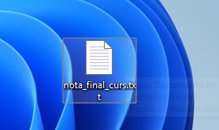

Contenido:

    L'alumne ha aprovat amb un 5

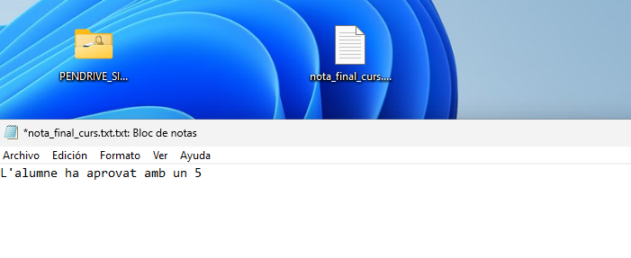

***

## 2.2. Calcular hash SHA‑256 del archivo original

Abrir **PowerShell (no administrador)** y ejecutar:

```
Get-FileHash "$env:USERPROFILE\Desktop\nota_final_curs.txt" -Algorithm SHA256
```
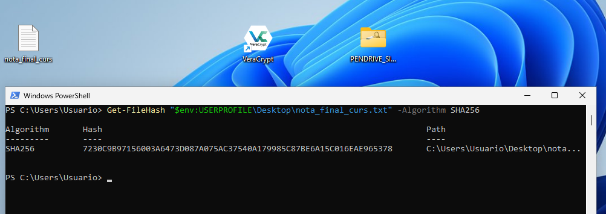

Guardar el hash mostrado.

***

## 2.3. Modificar el archivo

Editar el archivo y cambiar únicamente el número:

Antes:

    L'alumne ha aprovat amb un 5

Después:

    L'alumne ha aprovat amb un 9

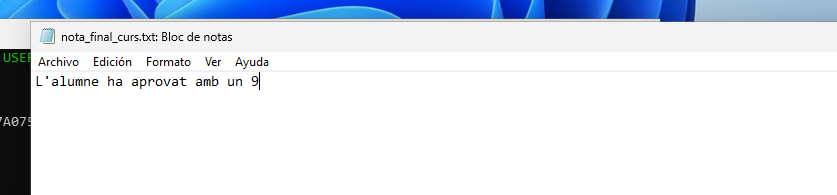

Guardar.

***

## 2.4. Calcular nuevamente el hash SHA‑256

Ejecutar en PowerShell:

```
Get-FileHash "$env:USERPROFILE\Desktop\nota_final_curs.txt" -Algorithm SHA256
```
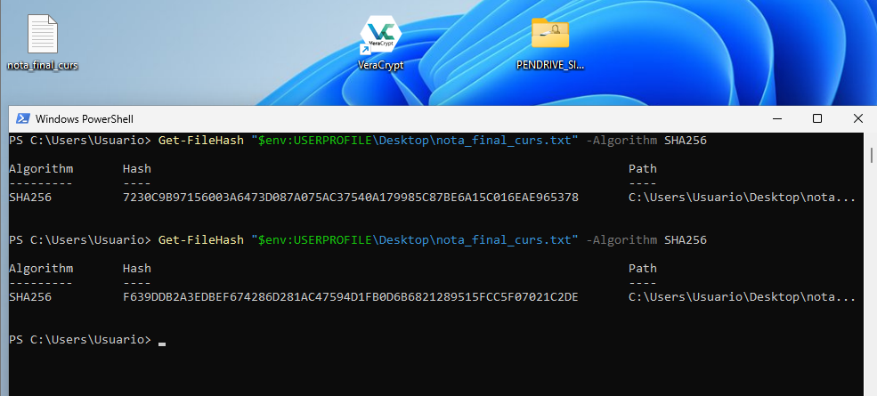

Comparar los dos valores:  
El hash cambia completamente incluso por un solo carácter modificado.

***
